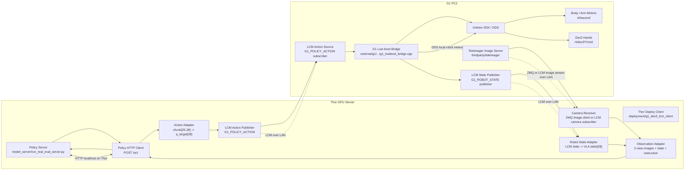

# G1 Dex3 VLA Deploy Pipeline



## Target Runtime Layout

권장 구조는 `Thor policy server + Thor deploy client + G1 PC2 LCM bridge`이다.

- Thor는 checkpoint inference, observation 구성, action post-processing을 담당한다.
- G1 PC2는 Unitree SDK/DDS motor command owner 역할만 담당한다.
- Thor process가 죽거나 LAN action이 끊겨도 G1 PC2 bridge가 timeout/fallback을 처리할 수 있어야 한다.
- WMA `unitree_deploy`의 direct DDS arm runtime은 사용하지 않는다. 필요한 경우 camera receiver, rollout loop, temporal ensemble 유틸만 재사용한다.

## Modules

| Module | Location | Runs On | Role | Input | Output | Communication |
|---|---|---:|---|---|---|---|
| Policy server | `deployment/model_server/run_real_eval_server.py` | Thor | Finetuned UnifoLM-VLA checkpoint inference | VLA observation payload: 2-view images, `state[28]`, instruction, task/unnorm key | Action chunk, expected `[25, 28]` for Dex3 | HTTP server, `POST /act` |
| Thor deploy client | `deployment/g1_dex3_lcm_client/` | Thor | Runtime orchestrator. Receives image/state, calls policy server, consumes action chunks, publishes action to bridge | Camera frames, `G1_ROBOT_STATE`, instruction/task config | `G1_POLICY_ACTION` LCM packet | HTTP to policy server, LCM to bridge, image stream receiver |
| Camera receiver | `deployment/g1_dex3_lcm_client/teleimager_camera.py` | Thor | Receive live camera frames and convert them into model image keys | Teleimager head stream from G1 PC2 | `image_primary`, `image_secondary`; optional wrist images for 4-view later | ZMQ via Teleimager |
| Observation adapter | `deployment/g1_dex3_lcm_client/client.py` | Thor | Build model input matching training schema | Images, robot state, language instruction | JSON payload for `/act` | In-process |
| Policy HTTP client | `deployment/g1_dex3_lcm_client/policy_client.py` | Thor | Call model server and parse action result | VLA observation payload | Raw action chunk | HTTP |
| Action adapter | `deployment/g1_dex3_lcm_client/action_adapter.py` | Thor | Convert model action chunk into bridge command semantics | Model action chunk `[25, 28]`; optional temporal ensemble state | One current `q_target[28]` absolute joint target | In-process |
| LCM action publisher | `deployment/g1_dex3_lcm_client/lcm_action.py` | Thor | Send target action to G1 bridge | `q_target[28]`, seq, timestamp | `G1_POLICY_ACTION` packet | LCM over LAN |
| G1 low-level bridge | `external/g1/29_dof_g1_deploy/g1_ws/src/g1_lowlevel_bridge.cpp` | G1 PC2 | Robot-side low-level command owner. Converts policy target into SDK/DDS commands and handles safety | LCM action, Unitree lowstate, Dex3 state, optional camera | `rt/lowcmd`, Dex3 command, `G1_ROBOT_STATE` | LCM + DDS |
| LCM action source | `external/g1/29_dof_g1_deploy/g1_ws/include/lcm_action_source.hpp` | G1 PC2 | Subscribe and parse policy action packets | `G1_POLICY_ACTION` | Latest valid policy command | LCM |
| LCM robot state publisher | `external/g1/29_dof_g1_deploy/g1_ws/include/lcm_robot_state_publisher.hpp` | G1 PC2 | Publish robot state for Thor client | LowState, IMU, Dex3 hand states | `G1_ROBOT_STATE` | LCM |
| Dex3 hand interface | `external/g1/29_dof_g1_deploy/g1_ws/include/dex3_hands.hpp` | G1 PC2 | Read/write Unitree Dex3 hand DDS topics | Hand target q, hand state topics | Left/right hand motor commands | DDS |
| Unitree SDK / DDS | `external/g1/29_dof_g1_deploy/thirdparty/unitree_sdk2` | G1 PC2 | Hardware communication layer | LowCmd, hand cmd | Motor actuation, state topics | DDS |

## Data Flow

1. G1 PC2 bridge subscribes to Unitree DDS state topics.
2. Bridge publishes `G1_ROBOT_STATE` over LCM to Thor.
3. Camera process on G1 PC2 streams live images to Thor.
4. Thor deploy client converts camera frames and robot state into VLA observation format.
5. Thor deploy client calls policy server `/act` over HTTP.
6. Policy server returns Dex3 action chunk, expected shape `[25, 28]`.
7. Thor deploy client selects/smooths one action target and publishes it as `G1_POLICY_ACTION`.
8. G1 bridge receives the LCM action, checks timeout/limits, and converts it to Unitree DDS commands.
9. Unitree SDK sends arm/body low-level command on `rt/lowcmd` and Dex3 hand commands on `rt/dex3/*/cmd`.

The Thor client does not query the policy on every control tick. It executes the
current `[25, 28]` chunk step by step and requests the next chunk before the
current chunk is exhausted. If the next policy response is late, it temporarily
holds the last absolute `q_target[28]` for a bounded number of publish ticks
(`--max-hold-steps`, default 2). After that it stops publishing actions so the
G1 bridge action timeout can switch to damping.

## Expected VLA Observation

Dex3 2-view checkpoint should receive images in the same order and naming used during training.

```text
image_primary
image_secondary
state[28]
instruction
task_name / unnorm_key
```

For a 4-view checkpoint, add:

```text
image_left_wrist
image_right_wrist
```

The `state[28]` order must match the training dataset. The working assumption is:

```text
left_arm[7] + left_hand[7] + right_arm[7] + right_hand[7]
```

This order should be verified against the RLDS/HDF5 conversion code before real robot execution.

## Expected Policy Action

The finetuned Dex3 VLA action is treated as:

```text
absolute G1 Dex3 joint target, shape [25, 28]
```

It should not be sent through the existing bridge path that interprets `action[29]` as relative/scaled body action. The bridge protocol should add a Dex3-specific action packet, for example:

```text
PolicyActionPacketV3
  seq
  timestamp_ns
  action_type = ABSOLUTE_G1_DEX3_28D
  q_target[28]
```

The bridge then splits `q_target[28]` into:

```text
left_arm[7]
left_hand[7]
right_arm[7]
right_hand[7]
```

Leg and waist joints are not predicted by the Dex3 checkpoint. The current V3
bridge path seeds all 29 low-level joint targets from the latest LowState and
then overwrites only the 14 arm joints. In practice this means legs/waist hold
their current posture with the configured bridge gains. This should be used only
in a stable fixed/supported manipulation setup, or replaced by an explicit
balance/stand-controller integration before free-standing deployment.

Legacy V1/V2 LCM action packets remain for compatibility, but the bridge no
longer globally replaces damping commands with the last valid policy command.
Stale actions, missing actions, and emergency-stop requests now send real
damping commands. If a legacy WMA-style runtime needs hold-last behavior, add it
as an explicit legacy mode instead of reusing the damping fallback.

## Communication Summary

| Link | Protocol | Direction | Notes |
|---|---|---|---|
| Thor deploy client -> policy server | HTTP | Thor local | `POST /act`; ideally localhost |
| G1 bridge -> Thor deploy client | LCM | G1 PC2 to Thor | `G1_ROBOT_STATE` |
| Thor deploy client -> G1 bridge | LCM | Thor to G1 PC2 | `G1_POLICY_ACTION` |
| G1 camera/image server -> Thor camera receiver | ZMQ | G1 PC2 to Thor | Teleimager defaults: head `55555`, config `60000` |
| G1 bridge -> Unitree body/arm motors | DDS | G1 PC2 local robot network | `rt/lowcmd` |
| G1 bridge -> Dex3 hands | DDS | G1 PC2 local robot network | `rt/dex3/left/cmd`, `rt/dex3/right/cmd` |
| Unitree robot -> G1 bridge | DDS | robot to G1 PC2 | `rt/lowstate`, IMU, Dex3 state topics |

## Required Implementation Points

1. Update `model_server` `/act` input handling for explicit Dex3 2-view/4-view observations.
2. Add Dex3 absolute 28D action packet support to LCM protocol and action source.
3. Modify bridge action application path to consume absolute `q_target[28]`, not relative `action[29]`.
4. Add or restore bridge safety: action timeout, stale sequence rejection, joint limits, max-delta clamp, fallback hold/damping.
5. Implement Thor deploy client:
   - LCM robot state subscriber
   - camera receiver
   - VLA observation adapter
   - HTTP policy client
   - temporal ensemble/action selection
   - LCM action publisher
6. Validate the full path in this order:
   - LCM fake action dry-run
   - state receive and state order check
   - camera receive and image order check
   - policy server inference with recorded observation
   - bridge dry-run action decode
   - real motor command with conservative limits
